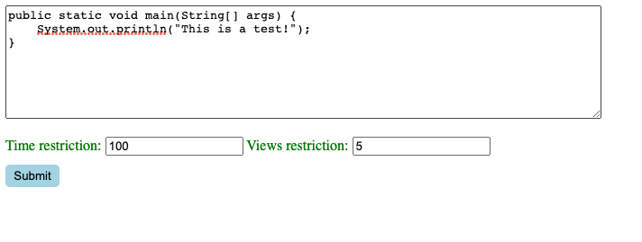
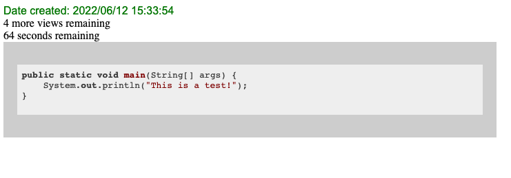
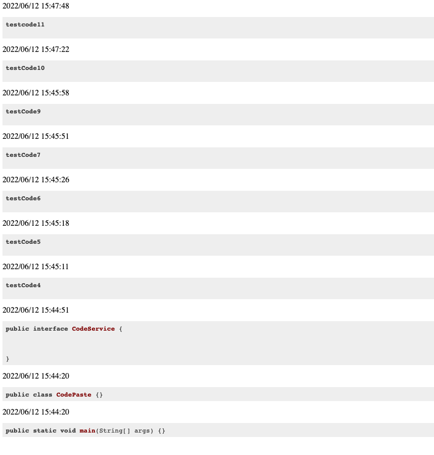

= CodePaste

Code sharing platform for collaborating amongst teammates.
This is similar to PasteBin. However, CodePaste provides an
API interface designed to be accessible locally.

== Code Snippets
You can specify if code snippets are meant to be restricted by setting the
number of views or time(in seconds) remaining. After either the views or
the time remaining is decremented to zero the code snippet is disabled and
deleted from the database. If the code snippet is initialized to zero for both
values then the code is set to unrestricted and will remain in the database
regardless of time in the database or number of views.

=== Snippets consist of
* (UUID) ID
* (LocalDateTime) Date -> Date uploaded
* (String) Code -> String value of the code uploaded
* (Integer) TimeRemaining -> Seconds remaining until code snippet is restricted from
viewing
* (Integer) Views -> Number of views remaining until code snippet is restricted from
viewing

== Web Interface
These are example calls to a web interface running at http://localhost:8889/code/new

./code/new/
* Web page allows the user to enter code into the provided input box and specify
if the code snippet is restricted by time or views

./code/+{id}+
* Web page accepts a path variable of type UUID, which represents the id of an upload
* Will return a ResponseDTO if an upload with the provided id exists and the
code is still enabled. Otherwise it will
route you to the "error-404" page
* ResponseDTO consists of
** (LocalDateTime) Date -> date uploaded
** (Integer) Views -> Number of views remaining
** (Integer) Time -> Seconds remaining

./code/latest/
* Web page fetches a list of the ten most recent uploads, in descending order
* List will only contain code snippets that do not have time or view restrictions

== API Interface
These are example calls to an api running at http://localhost:8080

.getCode Request
* Accepts a UUID path variable
include::target/snippets/getCode/http-request.adoc[]

.getCode Response
* Returns the code snippet associated with the provided UUID id,
if any are found
include::target/snippets/getCode/http-response.adoc[]

.postCode Request
* Request body accepts a RequestDTO that consists of
** (String) Code -> String value of the code uploaded
** (Integer) TimeRemaining -> Seconds remaining
** (Integer) Views -> Number of views remaining

include::target/snippets/postCode/http-request.adoc[]

.postCode Response
* Returns a ResponseDTO that consists of
** (UUID) ID
** (String) Code -> String value of the code uploaded

include::target/snippets/postCode/http-response.adoc[]

.getLatestUploads Request
include::target/snippets/getLatestUploads/http-request.adoc[]

.getLatestUploads Response
* Returns a list of the ten most recently uploaded code snippets, in descending order
* List will only contain code snippets that do not have time or view restrictions

include::target/snippets/getLatestUploads/http-response.adoc[]